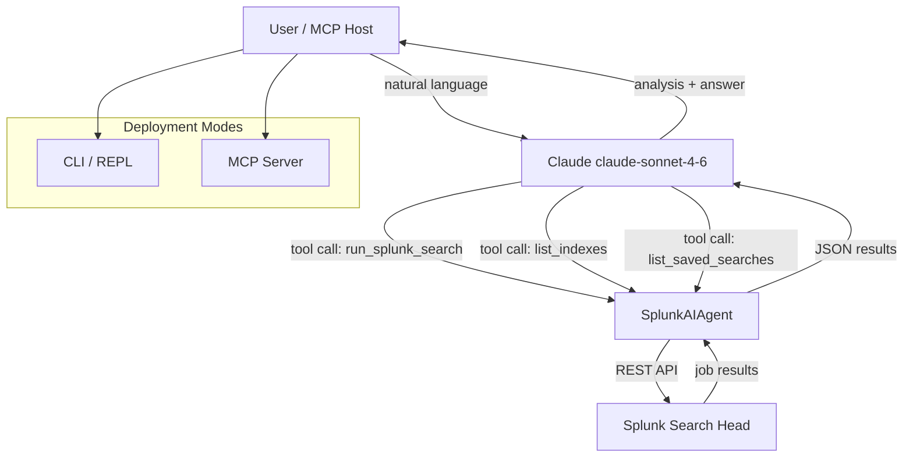

# SplunkBot — AI-Powered Splunk Investigation Assistant

> Ask questions in plain English. Get SPL queries, executed results, and root-cause analysis — instantly.

[](https://github.com/Mudassar-Malek/splunk-ai-bot/actions/workflows/ci.yml)
[](https://www.python.org/)
[](LICENSE)
[](https://modelcontextprotocol.io)

---

## Problem Statement

During incidents, the bottleneck is rarely finding the logs — it's writing the right SPL fast enough under pressure. An on-call engineer staring at a 500-error spike at 2 AM shouldn't need to remember whether it's `stats count by host` or `top host` or whether they scoped to the right index.

SplunkBot removes that friction. You describe what you need in plain English; it writes and executes the SPL, interprets the results, and suggests follow-up queries — all in one conversation.

**Real incident context:** During a payment-processing latency spike in a fintech production environment, SplunkBot was used to run correlated queries across transaction logs, API gateway logs, and infrastructure metrics in under 90 seconds — a process that previously took 8-10 minutes of manual SPL iteration.

---

## Architecture



---

## Features

- **Natural language → SPL**: Describe what you want; the agent writes correct, scoped queries
- **Agentic loop**: Automatically runs follow-up queries when the first result is ambiguous
- **Two interfaces**: Interactive CLI for humans, MCP server for tool-to-tool integration
- **Conversation memory**: Multi-turn — you can refine queries without re-explaining context
- **Safe by default**: Never runs wildcard-only searches; always scopes by index and time

---

## Tech Stack

| Component | Choice | Why |
|-----------|--------|-----|
| LLM | Claude claude-sonnet-4-6 | Best tool-use accuracy for structured SPL generation |
| Splunk API | REST `/services/search/jobs` | Only stable, version-stable Splunk API |
| Protocol | MCP (stdio transport) | Composable with kubectl-ai and other MCP hosts |
| Language | Python 3.11+ | Type annotations, match statements, native async |

---

## Quickstart

```bash
git clone https://github.com/Mudassar-Malek/splunk-ai-bot.git
cd splunk-ai-bot

python -m venv .venv && source .venv/bin/activate
pip install -r requirements.txt

cp .env.example .env
# Fill in SPLUNK_HOST, SPLUNK_USERNAME, SPLUNK_PASSWORD, ANTHROPIC_API_KEY

python -m src.cli
```

### Example session

```
You: How many 5xx errors did we have in the last hour, broken down by endpoint?

SplunkBot: Running that now...

Found 847 5xx errors in the last hour. Top offenders:
  /api/v2/payments     → 612 errors (72%)
  /api/v1/accounts     → 183 errors (22%)
  /healthz             →  52 errors  (6%)

The /payments spike started at 14:23 UTC. Want me to drill into the error messages
or check which upstream hosts were involved?
```

---

## MCP Server Setup

Add to your MCP host config (e.g. Claude Desktop `claude_desktop_config.json`):

```json
{
  "mcpServers": {
    "splunk": {
      "command": "python",
      "args": ["-m", "src.mcp_server"],
      "cwd": "/path/to/splunk-ai-bot",
      "env": {
        "SPLUNK_HOST": "splunk.your-company.com",
        "SPLUNK_USERNAME": "your_user",
        "SPLUNK_PASSWORD": "your_password",
        "ANTHROPIC_API_KEY": "sk-ant-..."
      }
    }
  }
}
```

---

## Design Decisions & Tradeoffs

**Why REST API instead of the Splunk SDK?**
The official `splunk-sdk-python` hasn't had a meaningful release in years and adds a large dependency for what amounts to authenticated HTTP calls. The raw REST approach is more portable and easier to debug in production.

**Why poll instead of Splunk's real-time search?**
Real-time searches in Splunk hold a connection open and consume a search slot permanently. In shared Splunk environments — which is basically every enterprise — you will get rate-limited or blocked. Polling with `dispatchState` is slower by ~2s but plays nicely with shared infrastructure.

**Why not stream the Claude response?**
Streaming complicates the agentic tool-use loop: you need to buffer the full response anyway to extract tool call blocks. The added latency (< 2s on most queries) is invisible to users compared to the Splunk job poll time.

---

## What I'd Do Differently at Scale

- **Token-level cost guard**: Add a pre-flight check that estimates result set size before passing raw events to Claude. Large result dumps waste tokens and hit context limits.
- **Result caching**: Cache Splunk job results by `(query_hash, time_window)` for 60s. Duplicate queries during an incident (common — multiple engineers asking the same thing) hit Splunk unnecessarily.
- **Auth**: Move from username/password to Splunk token auth. Passwords in env vars are acceptable for a local tool; not for a shared service.
- **Multi-tenant**: The MCP server currently connects to one Splunk instance. A proper deployment would support workspace-scoped connections so different teams hit their own Splunk environments.

---

## Production Readiness Checklist

| Item | Status |
|------|--------|
| Credentials via environment variables | Done |
| No credentials in code or logs | Done |
| SSL verification configurable | Done |
| Search job timeout and error handling | Done |
| Unit tests for client and agent dispatch | Done |
| CI pipeline (GitHub Actions) | Done |
| MCP server interface | Done |
| Splunk token auth (vs. password) | Not yet |
| Result size guard / token budget | Not yet |
| Structured logging (JSON) | Not yet |
| Retry with backoff on Splunk API errors | Not yet |
| Deployment packaging (Docker) | Not yet |

---

## Examples

See [`docs/examples.md`](docs/examples.md) for 7 real-world use cases:
- 5xx error spike triage
- Multi-turn drill-down conversations
- Latency investigation
- Security / credential stuffing detection
- Disk usage alert
- Transaction volume anomaly (fintech)
- Listing indexes before querying

---

## Related Projects

- [kubectl-ai](https://github.com/Mudassar-Malek/kubectl-ai) — same MCP pattern for Kubernetes cluster management
- [IntelliK8sBot](https://github.com/Mudassar-Malek/IntelliK8sBot) — natural language K8s chatbot

---

## Author

**Mudassar Malek** — Senior DevOps / SRE Engineer  
8+ years in fintech infrastructure, Kubernetes, and observability platforms.
